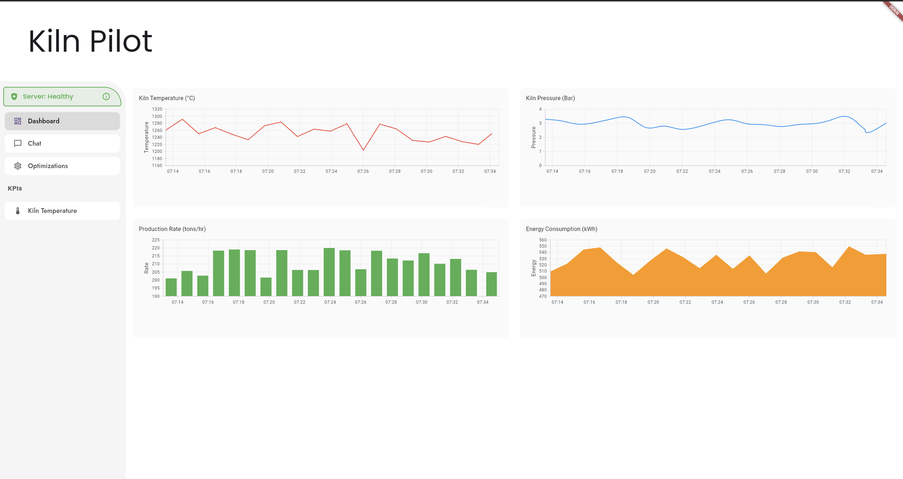
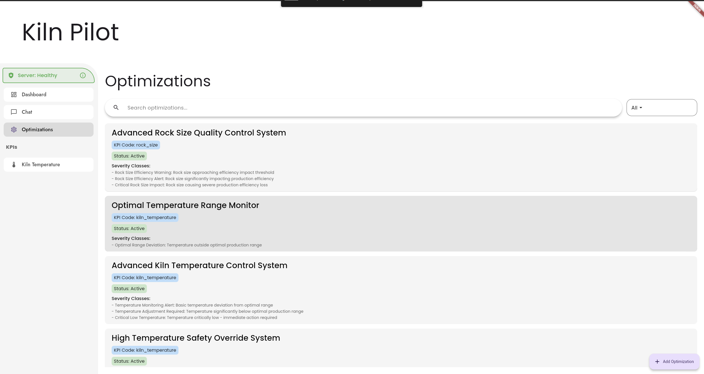
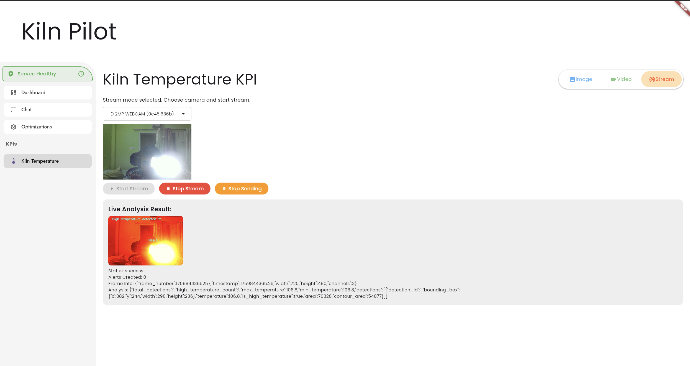
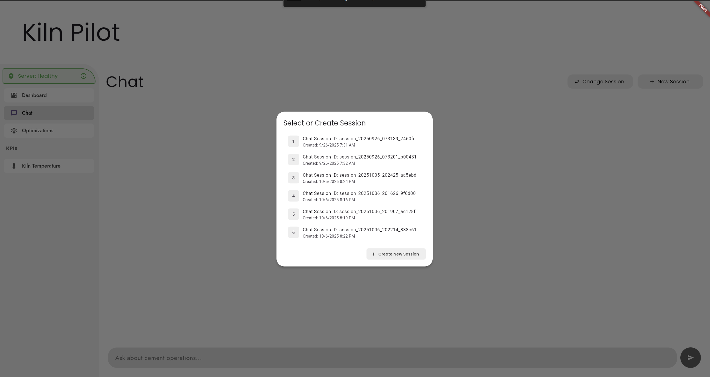

# KilnPilot (kilnpilot_alpha_flutter_app)


[](LICENSE) [](https://flutter.dev) [](https://pub.dev/) [](https://kiln-pilot.web.app/)

<!-- Tech stack badges -->
[](https://flutter.dev) [](https://fastapi.tiangolo.com/) [](https://developer.mozilla.org/en-US/docs/Web/API/WebSockets_API) [](https://developers.google.com/what-is/gemini) [](https://cloud.google.com/)

KilnPilot is a Flutter application for monitoring and optimizing cement kiln operations. It provides real-time telemetry, health monitoring, and optimization recommendations to help plant operators improve fuel efficiency and product quality.

## Demo & Video

- Live demo: https://kiln-pilot.web.app/

- Video (Google Drive): https://drive.google.com/file/d/1qVgwntstQs9rsg-vVopyZPK1snxbNeCt/view?usp=drivesdk


## Key Features

- Real-time kiln telemetry and visualizations
- Server health monitoring
- Optimization suggestions and KPIs
- Chatbot interface for guided assistance
- Serializers and data models generated with json_serializable

## Quickstart

Prerequisites:

- Flutter SDK (see https://docs.flutter.dev/get-started/install)
- Dart (bundled with Flutter)

Setup:

```powershell
git clone <your-repo-url>
cd kilnpilot.alpha.flutter.app
flutter pub get
```

Run the app (connected device or emulator):

```powershell
flutter run
```

If you update models annotated with `@JsonSerializable()`, regenerate serializers:

```powershell
dart run build_runner build --delete-conflicting-outputs
```

## Project layout (high-level)

- `lib/` - Flutter app source
  - `blocs/` - BLoC state management for features (chatbot, optimization, server_health, thermal_kpi)
  - `repositories/` - Data access and serializers
  - `screens/` - UI screens and routes
  - `constants/` - App-wide constants
  - `main.dart` - App entrypoint

- `android/`, `web/` - Platform-specific assets and configs


### Project screenshots

<p align="center">
  
</p>

*Dashboard — main app view showing KPIs and panels.*

<p align="center">
  
</p>

*Optimization dashboard — suggested actions and KPIs.*

<p align="center">
  
</p>

*Optimizations — detail view for applied optimizations.*

<p align="center">
  
</p>

*Kiln temperature KPI — time-series and KPI metrics.*

<p align="center">
  
</p>

*Chatbot — operator assistance and conversational UI.*

## Contributing

Contributions, issues and feature requests are welcome. Please open an issue first to discuss major changes.

Recommended workflow:

```powershell
git checkout -b feature/your-feature
# make changes
flutter pub get
dart run build_runner build --delete-conflicting-outputs
git add .
git commit -m "Add: short description"
git push origin feature/your-feature
```

## License

This project is licensed under the MIT License - see the `LICENSE` file for details.

---
